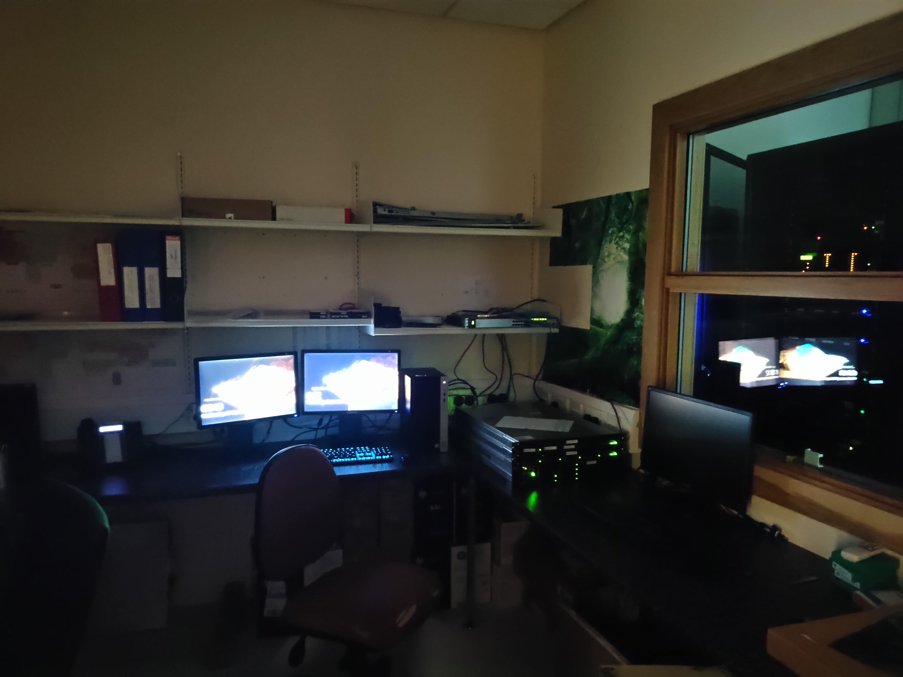

## 💻 Technical Info

Our current compute setup.

### 🧪 Development Environment

---

DeepText is currently developed using Anaconda for Python 3.8 and [JetBrains PyCharm Professional](https://www.jetbrains.com/pycharm/download/#section=windows). All of the code is being deployed and run on Windows Server 2022.

#### 🐍 Conda Environment

The project is built and run using an [Anaconda environment](https://anaconda.org/) and the latest `Tensorflow-CPU` environment yaml file can be found [here](https://github.com/71xn/DeepText/blob/main/tf.yml).

If you wish to use the project with `Tensorflow-GPU` then simply run `pip install tensorflow-gpu` followed by `pip install -U numpy`

### 📃 Webpage

---

The webpage for this project is hosted on github pages using `Jekyll` and the `Minimal Mistakes` theme found [here](https://mmistakes.github.io/minimal-mistakes/).
